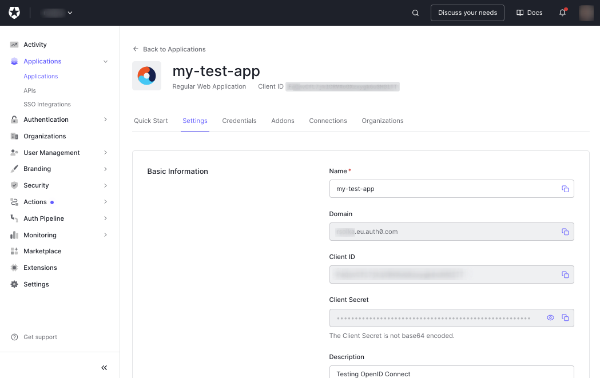

# OpenID Connect for Payara 5 Platform

This project provides a generic library to setup an OpenID Connect security mechanism for web applications running in Payara 5. Payara 5 provide a custom implementation to support OpenID Connect. You can find details in [Gaurav Gupta Blogpost](https://blog.payara.fish/openid-connect-in-the-payara-platform-5.183) as also in the [Blogpost from Rudy De Busscher](https://blog.payara.fish/how-to-use-openidconnect-with-payara-platform-to-achieve-single-sign-on). The implementation was inspired by [Andrew Hughes blogpost about Jakarta EE and OIDC](https://auth0.com/blog/jakarta-ee-oidc/).

**Note:** The `@OpenIdAuthenticationDefinition` used in this library is a proprietary extension from Payara 5. The implementation was later adapted into the [Jakarata Security API 3.0](https://jakarta.ee/specifications/security/3.0/) which is now part of Jakarta 10. We provide this library for projects still running on Payara 5. 


## Background

Since Jakarta EE 8 a new Security API was introduced providing a new standard and a portable way of handling security concerns in Java containers. This new standard allows to configure the Authentication mechanism of an application directly in a CDI bean instead through the web.xml file. So web applications can now configure Authentication mechanisms by providing implementations of the new `HttpAuthenticationMechanism` interface. Beside the standard implementations for Basic, Form and CustomForm authentication Payara 5 adapted very early this concept to provide authentication mechanism for OpenID Connect. To avoid to pollute the application code with proprietary code we introduced this library which can be added simply as an dependency to a web application project. 

**Note:** Also this solution is not perfect as it requires to create a custom build of your application code including this library. But it avoids the need to add implement the `fish.payara.security.annotations.OpenIdAuthenticationDefinition` directly in your application code. 


## Maven Dependecy

To use this lib you need to add the following maven dependencies to your application:


```xml
    <!-- Payara 5 OpenID Connect-->
    <dependency>
        <groupId>org.imixs.security</groupId>
        <artifactId>imixs-oidc-payara5</artifactId>
        <version>1.0.0-SNAPSHOT</version>
    </dependency>
```

Payara 5 automatically scann this library during deployment and initializes the OpenID Connect auth mechanism for your application. This is possible because of the `beans.xml` file located in the META-INF folder of this library. 

## Auth0 OIDC

For testing and also production you can easily setup an OpenID login account with [auth0](https://auth0.com/). 
If you have not already, [install the Auth0 CLI](https://github.com/auth0/auth0-cli#installation) and run auth0 login in a terminal:

```
$ ./auth0 login
✪ Welcome to the Auth0 CLI 🎊

An Auth0 tenant is required to operate this CLI.
To create one, visit: https://auth0.com/signup.

You may authenticate to your tenant either as a user with personal
credentials or as a machine via client credentials. For more
information about authenticating the CLI to your tenant, visit
the docs: https://auth0.github.io/auth0-cli/auth0_login.html

 How would you like to authenticate?  [Use arrows to move, type to filter, ? for more help]
> As a user
  As a machine
```

If you already have setup a tenant you can check the existing domain with

```
$ auth0 tenants list
===  

  AVAILABLE TENANTS    
  foo.eu.auth0.com 
```

The tenant domain is your Auth0 domain and needed for further configuration. 

Now use the Auth0 CLI to create an OpenID Connect (OIDC) application:

```
auth0 apps create

    Name: my-test-app
    Description: Testing OpenID Connect
    Type: Regular Web Application
    Callback URLs: http://localhost:8080/callback
    Allowed Logout URLs: http://localhost:8080
```


The console output shows you the Auth0 domain and the OIDC client ID. However, you also need the client secret. You will find this on the dashboard when your are logged into [Auth0](https://manage.auth0.com)




## Configuration

The Payara5 OpenID Client configuration attributes can be configured via Microprofile Config using the following properties :

```
    payara.security.openid.providerURI
    payara.security.openid.clientId
    payara.security.openid.clientSecret
    payara.security.openid.redirectURI
```

Microprofile Config is part of Payara 5 and the properties value take precedence over @OpenIdAuthenticationDefinition annotation values.

Setting the properties in Docker or a Kubernetes environment use the corresponding Unix style to name the variables:

```
    PAYARA_SECURITY_OPENID_PROVIDERURI
    PAYARA_SECURITY_OPENID_CLIENTID
    PAYARA_SECURITY_OPENID_CLIENTSECRET
    PAYARA_SECURITY_OPENID_REDIRECTURI
```


